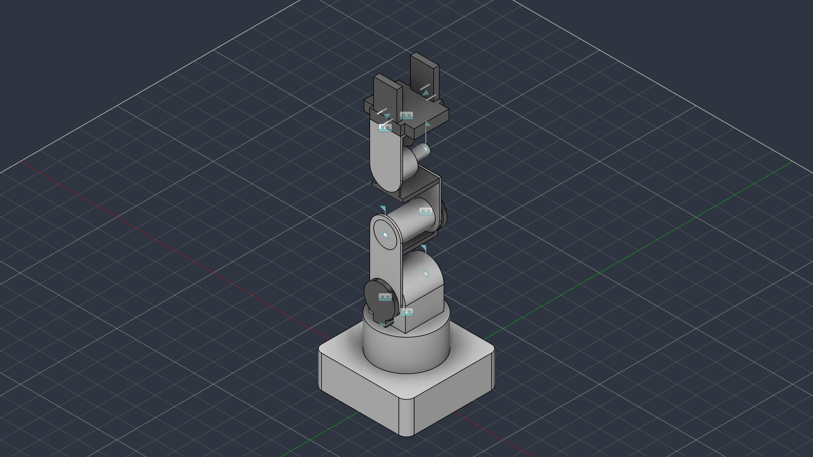

# marav1 — Robot Description



## Overview

| Property | Value |
|----------|-------|
| Total mass | 13.701 kg |
| Links | 12 |
| Joints | 11 (6 movable) |
| Assemblies | 1 |
| Root link | `base_link` |

## Table of Contents

- [Kinematic Tree](#kinematic-tree)
- [Link Properties](#link-properties)
- [Joint Properties](#joint-properties)
- [Assembly Breakdown](#assembly-breakdown)
- [Quick Start (ROS 2)](#quick-start-ros-2)
- [Files](#files)

## Kinematic Tree

```
base_link
  └─ Revolute_1 [continuous]
    2nd_link [BAKE]
      └─ Rigid_10 [fixed]
        1st_encoder
      └─ Revolute_2 [continuous]
        3rd_link [BAKE]
          └─ Rigid_14 [fixed]
            2nd_encoder
          └─ Revolute_3 [continuous]
            4th_link [BAKE]
              └─ Rigid_13 [fixed]
                wrist_base
              └─ Revolute_4 [continuous]
                5th_link [BAKE]
                  └─ Rigid_15 [fixed]
                    gripper_motor
                  └─ Rigid_5 [fixed]
                    camera_holder
                      └─ Slider_7 [prismatic]
                        gripper_tooth_1 [BAKE]
                      └─ Slider_12 [prismatic]
                        gripper_tooth_2 [BAKE]
```

## Link Properties

| Link | Mass (kg) | Material | Collision | Bodies |
|------|-----------|----------|-----------|--------|
| `1st_encoder` | 0.4570 | Steel | visual_reuse | 1 |
| `2nd_encoder` | 0.6946 | Steel | visual_reuse | 1 |
| `2nd_link` | 0.6453 | Generic | visual_reuse | 1 |
| `3rd_link` | 0.3497 | Generic | visual_reuse | 1 |
| `4th_link` | 0.3341 | Generic | visual_reuse | 1 |
| `5th_link` | 0.2605 | Generic | visual_reuse | 1 |
| `base_link` | 6.4506 | Generic | visual_reuse | 1 |
| `camera_holder` | 2.6101 | Steel | visual_reuse | 1 |
| `gripper_motor` | 0.2119 | Steel | visual_reuse | 1 |
| `gripper_tooth_1` | 0.5299 | Steel | visual_reuse | 1 |
| `gripper_tooth_2` | 0.5299 | Steel | visual_reuse | 1 |
| `wrist_base` | 0.6269 | Steel | visual_reuse | 1 |

## Joint Properties

| Joint | Type | Parent → Child | Axis | Limits |
|-------|------|---------------|------|--------|
| `Revolute_1` | continuous | `base_link` → `2nd_link` | (0,0,1) | — |
| `Revolute_2` | continuous | `2nd_link` → `3rd_link` | (0,0,1) | — |
| `Revolute_3` | continuous | `3rd_link` → `4th_link` | (0,0,1) | — |
| `Revolute_4` | continuous | `4th_link` → `5th_link` | (0,0,1) | — |
| `Rigid_10` | fixed | `2nd_link` → `1st_encoder` | (0,0,1) | — |
| `Rigid_13` | fixed | `4th_link` → `wrist_base` | (0,0,1) | — |
| `Rigid_14` | fixed | `3rd_link` → `2nd_encoder` | (0,0,1) | — |
| `Rigid_15` | fixed | `5th_link` → `gripper_motor` | (0,0,1) | — |
| `Rigid_5` | fixed | `5th_link` → `camera_holder` | (0,0,1) | — |
| `Slider_12` | prismatic | `camera_holder` → `gripper_tooth_2` | (0,1,0) | [0.0, 40.0] mm |
| `Slider_7` | prismatic | `camera_holder` → `gripper_tooth_1` | (0,-1,0) | [0.0, 40.0] mm |

## Assembly Breakdown

### marav1

- **Links**: 2nd_link, base_link, 3rd_link, 4th_link, 5th_link, camera_holder, gripper_tooth_1, 1st_encoder, 2nd_encoder, wrist_base, gripper_tooth_2, gripper_motor
- **Total mass**: 13.701 kg

## Quick Start (ROS 2)

```bash
# 1. Copy package to your ROS 2 workspace
cp -r marav1_description ~/ros2_ws/src/

# 2. Build
cd ~/ros2_ws
colcon build --packages-select marav1_description
source install/setup.bash

# 3. Visualize in RViz2
ros2 launch marav1_description display.launch.py

# 4. Validate URDF structure
check_urdf install/marav1_description/share/marav1_description/urdf/marav1.urdf

# 5. Print kinematic tree
urdf_to_graphviz install/marav1_description/share/marav1_description/urdf/marav1.urdf
```

**Joint control**: The launch file includes `joint_state_publisher_gui` —
use the sliders to move revolute/prismatic joints in RViz2.

**Topic inspection**:
```bash
# See published joint states
ros2 topic echo /joint_states

# See robot description parameter
ros2 param get /robot_state_publisher robot_description
```

## Files

| Path | Description |
|------|-------------|
| `urdf/marav1.urdf.xacro` | Top-level xacro (entry point) |
| `urdf/marav1.urdf` | Flat URDF (for validation) |
| `urdf/assemblies/` | Per-assembly xacro macros |
| `meshes/` | Visual (OBJ) and collision (STL) meshes |
| `launch/display.launch.py` | Launch robot_state_publisher, RViz, and generated controllers |
| `config/joint_state.yaml` | Joint state publisher config |
| `config/ros2_controllers.yaml` | Generated ros2_control controller manager config |
| `robot_data.yaml` | Supplementary data (beyond URDF) |
| `docs/transforms.md` | Transformation matrices (KaTeX) |

## Customizing

Assemblies tagged `!dummy_` are designed to be swapped out. To replace one:

1. Create your replacement as a xacro macro with the same interface
2. Place it in `urdf/assemblies/`
3. Update the `<xacro:include>` in `urdf/marav1.urdf.xacro`
4. Update meshes in `meshes/<your_assembly>/`

The xacro prefix system (`${prefix}`) ensures link names stay unique
when multiple instances of the same assembly are used.

---
*Generated by Fusion URDF/XACRO Exporter v3.1.0*