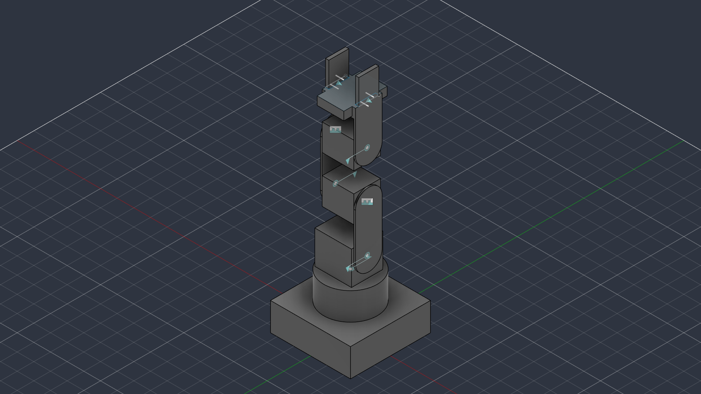

# marav2ckptbest — Robot Description



## Overview

| Property | Value |
|----------|-------|
| Total mass | 73.633 kg |
| Links | 9 |
| Joints | 8 (6 movable) |
| Assemblies | 1 |
| Root link | `base_link` |

## Table of Contents

- [Kinematic Tree](#kinematic-tree)
- [Link Properties](#link-properties)
- [Joint Properties](#joint-properties)
- [Assembly Breakdown](#assembly-breakdown)
- [Quick Start (ROS 2)](#quick-start-ros-2)
- [Files](#files)

## Kinematic Tree

```
base_link
  └─ Revolute_1 [continuous]
    shoulder_link [BAKE]
      └─ Revolute_5 [continuous]
        shoulder_arm [BAKE]
          └─ Rigid_6 [fixed]
            elbow_link
              └─ Revolute_7 [continuous]
                elbow_arm [BAKE]
                  └─ Rigid_8 [fixed]
                    wrist_link
                      └─ Revolute_9 [continuous]
                        wrist_arm [BAKE]
                          └─ Slider_10 [prismatic]
                            gripper_teeth [BAKE]
                          └─ Slider_11 [prismatic]
                            gripper_teeth2 [BAKE]
```

## Link Properties

| Link | Mass (kg) | Material | Collision | Bodies |
|------|-----------|----------|-----------|--------|
| `base_link` | 50.9238 | Steel | visual_reuse | 2 |
| `elbow_arm` | 0.6369 | Steel | visual_reuse | 1 |
| `elbow_link` | 4.7728 | Steel | visual_reuse | 1 |
| `gripper_teeth` | 0.3532 | Steel | visual_reuse | 1 |
| `gripper_teeth2` | 0.3532 | Steel | visual_reuse | 1 |
| `shoulder_arm` | 0.6369 | Steel | visual_reuse | 1 |
| `shoulder_link` | 8.1169 | Steel | visual_reuse | 1 |
| `wrist_arm` | 3.0659 | Steel | visual_reuse | 1 |
| `wrist_link` | 4.7728 | Steel | visual_reuse | 1 |

## Joint Properties

| Joint | Type | Parent → Child | Axis | Limits |
|-------|------|---------------|------|--------|
| `Revolute_1` | continuous | `base_link` → `shoulder_link` | (0,0,1) | — |
| `Revolute_5` | continuous | `shoulder_link` → `shoulder_arm` | (0,0,1) | — |
| `Revolute_7` | continuous | `elbow_link` → `elbow_arm` | (0,0,1) | — |
| `Revolute_9` | continuous | `wrist_link` → `wrist_arm` | (0,0,1) | — |
| `Rigid_6` | fixed | `shoulder_arm` → `elbow_link` | (0,0,1) | — |
| `Rigid_8` | fixed | `elbow_arm` → `wrist_link` | (0,0,1) | — |
| `Slider_10` | prismatic | `wrist_arm` → `gripper_teeth` | (1,0,0) | [0.0, 40.0] mm |
| `Slider_11` | prismatic | `wrist_arm` → `gripper_teeth2` | (1,0,0) | [-40.0, 0.0] mm |

## Assembly Breakdown

### marav2ckptbest

- **Links**: shoulder_link, base_link, shoulder_arm, elbow_link, elbow_arm, wrist_link, wrist_arm, gripper_teeth, gripper_teeth2
- **Total mass**: 73.633 kg

## Quick Start (ROS 2)

```bash
# 1. Copy package to your ROS 2 workspace
cp -r marav2ckptbest_description ~/ros2_ws/src/

# 2. Build
cd ~/ros2_ws
colcon build --packages-select marav2ckptbest_description
source install/setup.bash

# 3. Visualize in RViz2
ros2 launch marav2ckptbest_description display.launch.py

# 4. Validate URDF structure
check_urdf install/marav2ckptbest_description/share/marav2ckptbest_description/urdf/marav2ckptbest.urdf

# 5. Print kinematic tree
urdf_to_graphviz install/marav2ckptbest_description/share/marav2ckptbest_description/urdf/marav2ckptbest.urdf
```

**Joint control**: The launch file includes `joint_state_publisher_gui` —
use the sliders to move revolute/prismatic joints in RViz2.

**Topic inspection**:
```bash
# See published joint states
ros2 topic echo /joint_states

# See robot description parameter
ros2 param get /robot_state_publisher robot_description
```

## Files

| Path | Description |
|------|-------------|
| `urdf/marav2ckptbest.urdf.xacro` | Top-level xacro (entry point) |
| `urdf/marav2ckptbest.urdf` | Flat URDF (for validation) |
| `urdf/assemblies/` | Per-assembly xacro macros |
| `meshes/` | Visual (OBJ) and collision (STL) meshes |
| `launch/display.launch.py` | Launch robot_state_publisher, RViz, and generated controllers |
| `config/joint_state.yaml` | Joint state publisher config |
| `config/ros2_controllers.yaml` | Generated ros2_control controller manager config |
| `robot_data.yaml` | Supplementary data (beyond URDF) |
| `docs/transforms.md` | Transformation matrices (KaTeX) |

## Customizing

Assemblies tagged `!dummy_` are designed to be swapped out. To replace one:

1. Create your replacement as a xacro macro with the same interface
2. Place it in `urdf/assemblies/`
3. Update the `<xacro:include>` in `urdf/marav2ckptbest.urdf.xacro`
4. Update meshes in `meshes/<your_assembly>/`

The xacro prefix system (`${prefix}`) ensures link names stay unique
when multiple instances of the same assembly are used.

---
*Generated by Fusion URDF/XACRO Exporter v3.1.1*